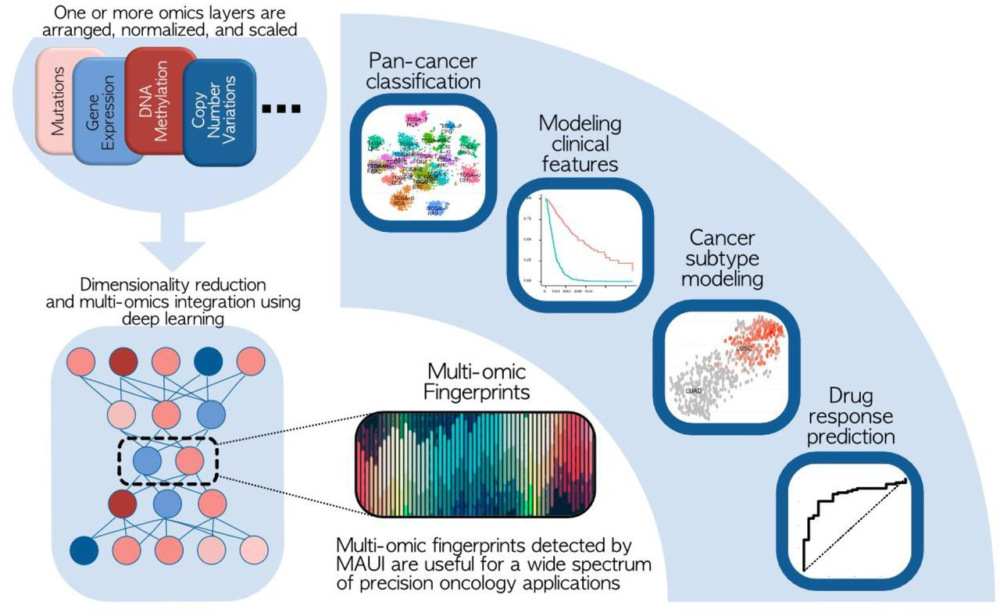
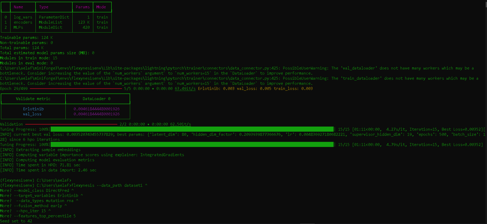
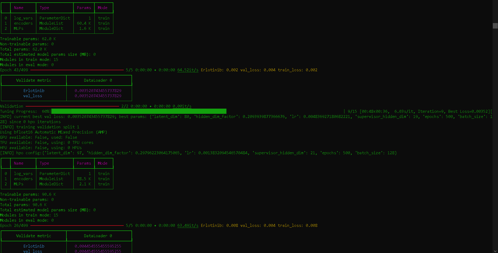
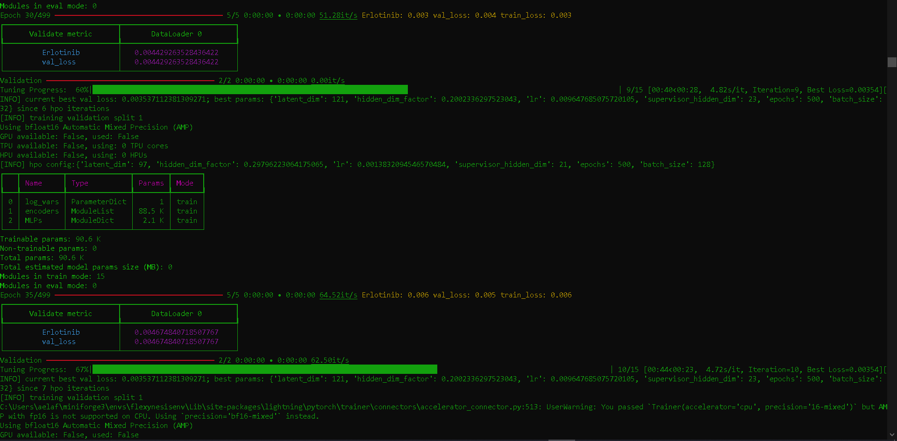
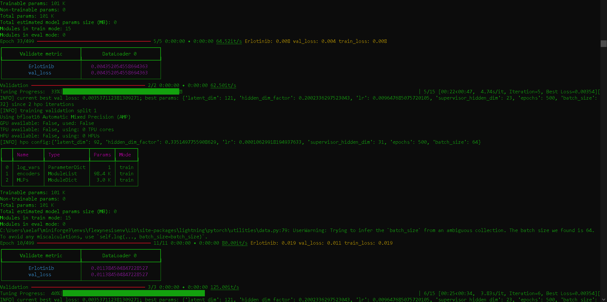

# Multi-Omics Benchmarking by Deep Learning for Erlotinib Response Prediction in Cancer Cell-Lines

This project evaluates deep learning architectures for predicting drug response using multi-omics data from CCLE and GDSC. By testing different model architectures, omic data combinations, and fusion strategies, we benchmark performance and identify key biomarkers linked to Erlotinib sensitivity. Results are analyzed in a Jupyter notebook to explore embeddings and feature importance, contributing insights into precision oncology.

<p align="center">
  
</p>

Multi-omics and deep learning provide a multifaceted view of cancer
Bora Uyar, Jonathan Ronen, Vedran Franke, Gaetano Gargiulo, Altuna Akalin
bioRxiv 2021.09.29.462364; doi: https://doi.org/10.1101/2021.09.29.462364

## Dataset
- Multi-omics data from CCLE (Cancer Cell Line Encyclopedia) and GDSC (Genomics of Drug Sensitivity in Cancer).
- Features include mutations, gene expression (RNA-seq), and copy number variations (CNV).
- The CCLE dataset is used for training, while the GDSC dataset is used for evaluation.
[**You can download and unpack through this link**](https://bimsbstatic.mdc-berlin.de/akalin/buyar/flexynesis-benchmark-datasets/ccle_vs_gdsc.tgz)

## Project Overview (Part-1)
- I used the flexynesis framework on the command line to predict the drug responses for “Erlotinib”
It have been done by: 
- Different architectures: DirectPred, Supervised VAE, and GNN.
- Data type combinations: mutation, mutation + RNA, mutation + cnv.
- Fusion methods: early, intermediate.
  - Batch Size: 32, 64, and 128.
  - Epoches: 500
### This was done using these 8 combination:
- Test 1: DirectPred + GEX + Early Fusion
- Test 2: DirectPred  + GEX + Intermediate Fusion
- Test 3: DirectPred + CNV  + Early Fusion
- Test 4: DirectPred + Clin + Intermediate Fusion
- Test 5: DirectPred + Clin + GEX + CNV+ Intermediate Fusion
- Test 6: DirectPred + CNV + GEX +  Intermediate Fusion
- Test 7: SupervisedVAE + CNV + Early Fusion
- Test 8: SupervisedVAE + CNV + GEX + Intermediate Fusion

### Snapshots during running the experiments
<table align="center">
  <tr>
    <td></td>
    <td></td>
  </tr>
  <tr>
    <td></td>
    <td></td>
  </tr>
</table>


## Project Overview (Part-2)
Analysing the output CSV files using Colab after running the model in the command-line environment, the output files are:
- M.embeddings_test
- M.embeddings_train
- M.feature_importance.IntegratedGradients
- M.feature_logs.cnv
- M.feature_logs.gex
- M.predicted_labels
- M.stats

### This step inculdes:
- Experiment Ranking: Imported experiment results from step 3 and ranked them based on Pearson correlation coefficient (pearson_corr) to determine the optimal model configuration.
- Latent Space Analysis: Examined the train/test embeddings from the top-performing model to assess feature separability and clustering behavior.
- Feature Importance & Biomarker Discovery: Retrieved the top 10 most important markers from the best model based on feature importance scores. Conducted a literature review to investigate potential associations between these markers and Erlotinib, a tyrosine kinase inhibitor.


## Installation and pre
To run the model, ensure you have the necessary dependencies installed:
- Install Mamba (via miniforge) to download its .exe [**From here**](https://github.com/conda-forge/miniforge?tab=readme-ov-file)
```sh
conda install mamba -n base -c conda-forge
```
- Install Flexynesis
```sh
pip install flexynesis
```
-  Install Required Python Packages
```sh
pip install numpy pandas matplotlib seaborn scipy scikit-learn jupyter tqdm
```

-  If you plan to use GNN-based models, install PyTorch Geometric and dependencies:
```sh
pip install torch-scatter torch-sparse torch-cluster torch-spline-conv torch-geometric
```
For training and evaluation, follow the provided scripts in the repository.

## Conclusion
This project demonstrates the effectiveness of Flexynesis in multi-omics in precision oncology. High precision and recall indicate its potential for clinical applications.

## License
**Copyright (c) 2025 Abdullah Elafifi**

